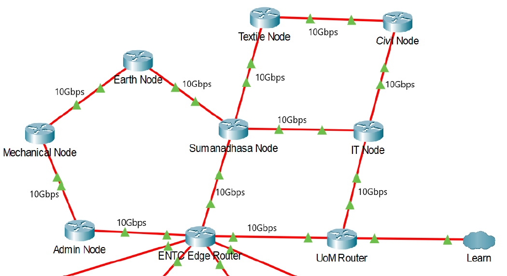
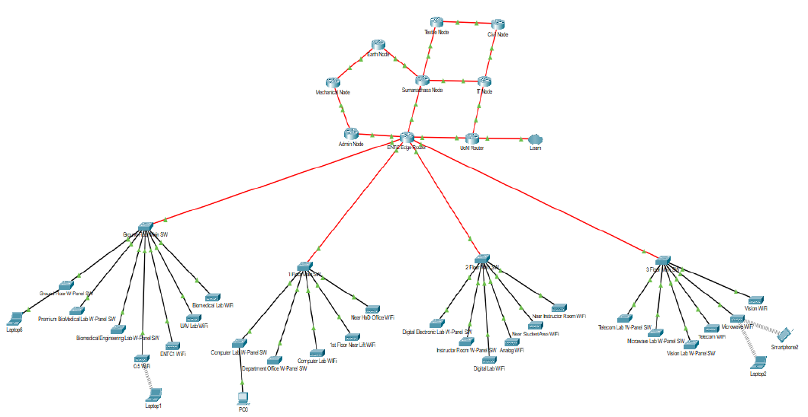

# LAN Design 

> **Semester 4 Project** for the Communication Network Engineering module.

---

## 📚 **Project Overview**  
This project focuses on designing the **backbone network** for the **University of Moratuwa** and the **network distribution** for the ENTC building.  

### **Key Objectives**:
1. Design a long-term backbone network (20–25 years) for UOM.
2. Ensure connectivity for:
   - Academic faculties/departments
   - Administrative offices
   - Library and Data Center 
3. Optimize the **total cost of cabling** while considering both **active** and **passive** systems.

---

## 🛠️ **Design Highlights**
- **Backbone Network**: Connects multiple buildings on the UOM campus.  
- **ENTC Building Network**: Connects multiple floors and labs on the ENTC premises.
- Simulated using **Cisco Packet Tracer**.

### **Components Considered**:
1. **Passive Systems**:
   - Copper and fiber cabling
   - Patch panels (copper & fiber)  
2. **Active Systems**:
   - Network switches
   - Routers  

---

## 🔧 **Simulation Tools**
We used **Cisco Packet Tracer** to simulate:
1. **ENTC Network**
2. **Backbone Network**

---

## 🖼️ **Visuals**
### **Campus Backbone Network Layout**  

### **ENTC Building Network Simulation**  
  


---

## 📂 **Folder Structure**
```plaintext
├── README.md
├── ENTC_network.pkt  # Cisco Packet Tracer file for ENTC simulation.
├── Backbone_network.pkt  # Cisco Packet Tracer file for backbone network.
└── Documentation
    ├── Design_Diagram.pdf  # Detailed design of the network.
    ├── Cost_Analysis.xlsx  # Cost breakdown.
    └── Network_Components.md  # Description of active & passive systems.


